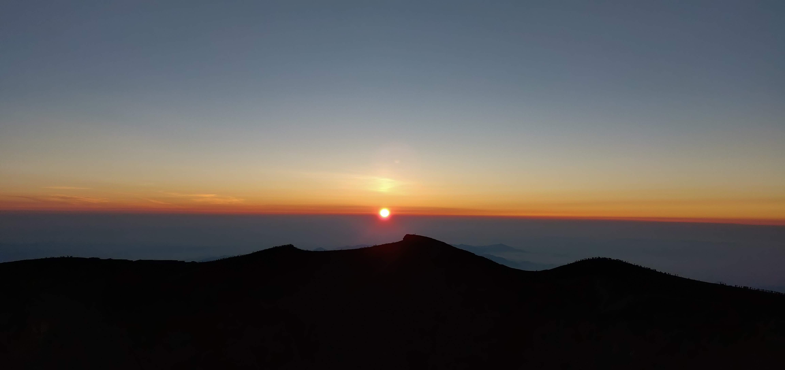
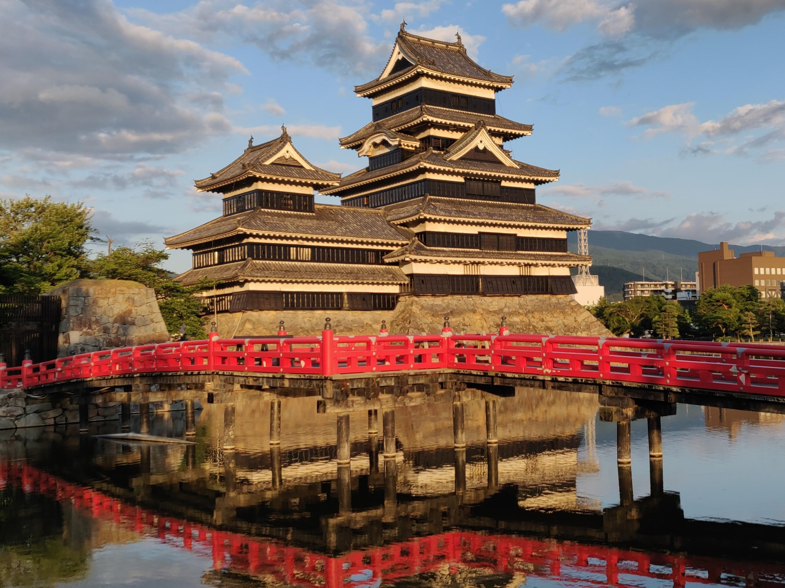

# Working in the __land__ of the __Rising Sun__

&#xfeff  | &#xfeff 
------------- | ------------- 
Type  | Stack  
Internship | Vue.js 
&#xfeff | D3.js  
&#xfeff | JavaScript  

<Grid columns="40% 60%">

## Working  at Fujitsu  

I had the opportunty to work with the Fujutsu Software Technologies (FST) team in Matsumoto, Japan. This was an amazing experience where I was pushed beyond my comfort zone.  
During the summer, I challenged in every aspect of my life, from developing with new frameworks to adapting to a foreign culture.  
Prior to arriving there, I had set some personal goals to know what I wanted to improve on. My main priorities were focused on improving my current programming skills and learning from some of the people working for one of the largest IT services provider in Japan.  

</Grid>

  

<Grid columns="40% 60%">

## Overview

This summer was one of the most challenging, yet rewarding, experience I've had. Traveling overseas and experiencing a new culture really expanded my horizons and thought me valuable lessons.  
At FST, I developed an interactive visualization tool using D3.js and Vue.js. The complex user interactions requested by the client truly tested my analytical skills and pushed my problem-solving skills to the next level.  
The biggest challenge was the communication barrier. As Matsumoto is closer to a country-side city, not many people spoke English inside\outisde of work. It took time and effort to talk with my colleagues, which made learning from them a significantly difficult task.

</Grid>

<Grid columns={"1fr 1fr"}>

 

</Grid>

<Grid columns="40% 60%">

## Summary

My experience at FST was not perfect, but it will be something that I will cherish forever, and I want to thank everybody at FST for their kindness and for the time they took to teach me about their wonderful culture. It really showed me how little I knew about the world, which excites me even more as it means that I just have that much more to learn.

</Grid>
