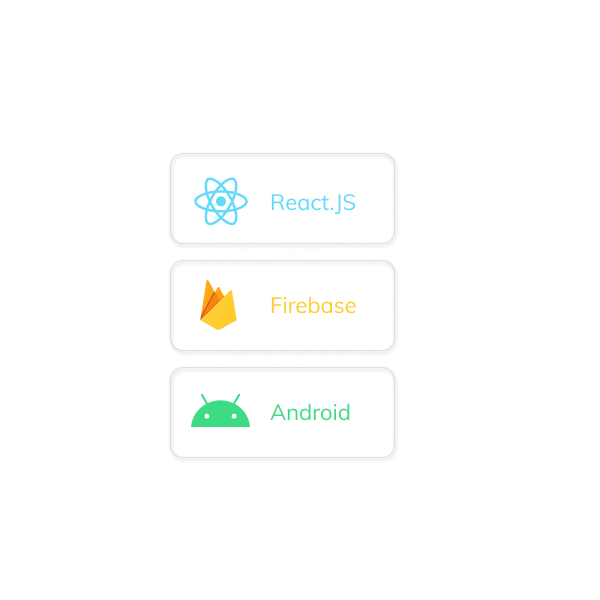
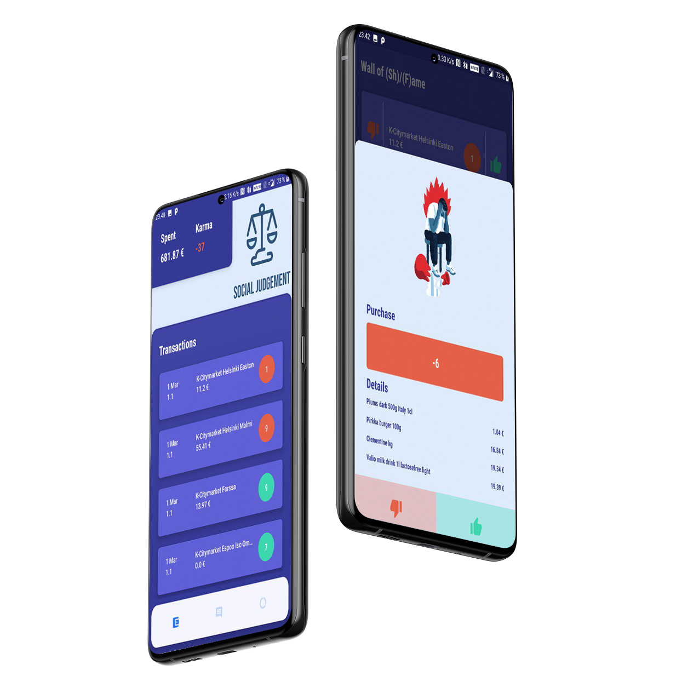
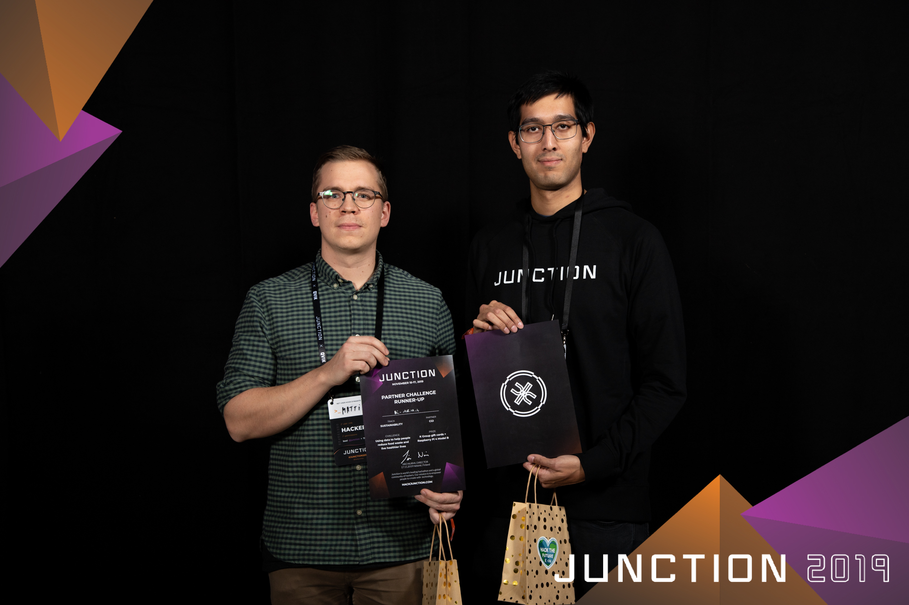

# Joining the Sustainability Track

Junction is an annual hackathon that gathers around 1'500 hackers for a weekend long experience. A place where designers, developers, and other techies team up to create new tech projects in 48 hours.  
This time, my friend Matti and I joined to form a team, of all the 8 tracks, we decided to join the sustainability challenge issued by CGI and K-Group.  
This challenge pushed us invent a novel solution to support people in making daily choices that increases their health, reduces food waste, and incites living a more sustainable lifestyle. 

|||
|------------- | -------------|
|  | <h1>Our solution</h1>We tried to improve the clients' spending habits through social interaction and gamification. We build a React.js dashboard and an Android application that is served by a Firebase Real-time database. The application offers weekly challenges to the users, which are define to help the users make more sustainable purchase decisions depending on the user group. On top of helping the user be healtier and smarter in their spending habits, they also benefit from special rewards given when completing a challenge. The system also uses social interactions between users, by doing so, the users will be able to help one another become more mindful and concious about the products that they will buy. |
|  |  |

# Summary

Hackathons are a great way to challenge thyself, being surrounded by such innovative people is an incredible experience. We gave our best effort into delivering a product we tought could really help people become more sustainable.  
The idea and our demonstration was enthousiastically received by the challenge issuers, as a result, we received the 2nd place price of the challenge. An extra big than you to my teammate [Matti](https://www.linkedin.com/in/matti-mk/) for the fun experience and for enduring me when I was sleep-deprieved.

 
 

 
