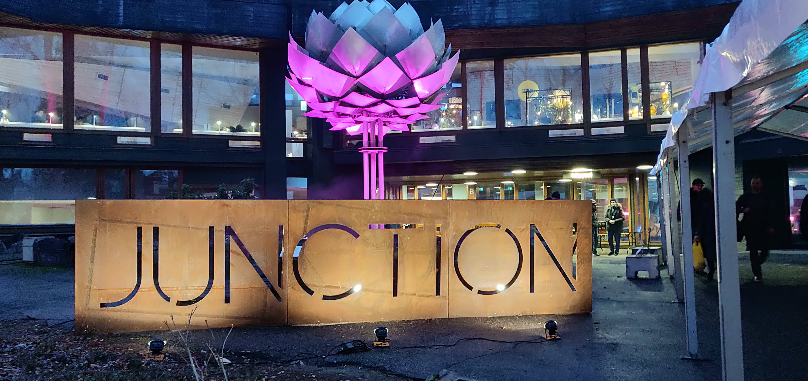

# Using __data__ to help people reduce __food waste__ and live healthier lives

&#xfeff  | &#xfeff  | &#xfeff
------------- | ------------- | -------------
Type  | Stack  | Code
Hackathon | Android  | [GitHub](https://github.com/robsel118/Junction_2019)
&#xfeff | React.js  | 
&#xfeff | Firebase  | 

<Grid columns="40% 60%">

## CHALLENGE
 
People are striving to make more sustainable choices in their everyday lives and consumption. Healthy choices, as well as being able to reduce the amount of food waste, are becoming more and more important values in modern society.  
As we know, climate change and increasing emissions raise concerns for many. However, lack of knowledge and tools restrict people from taking measures. It’s time for action and success requires cooperation.  
At Junction 2019, CGI and K-Group issued a challenge to find innovative ways of using transaction data from grocery retail to create new services to help people to adopt a more healthier and sustainable lifestyle.

</Grid>

<Grid columns="40% 60%">

## our Solution

Our team (composed of Matti and I) developed an application that leverages social interactions by allowing them to "judge" other user's baskets, pushing them to be more mindful about their purchase and curious about other products.  
The application also provides daily and weekly challenges that will help the users make healthier purchase decisions or suggests them more sustainable alternative to products that they often buy. A completed challenge provides points which can eventually be redeemed, e.g. coupon or discount on certain products.  
As a result, we developed a React and Android application that can be used to rate baskets and view all the challenges and their progress. The data comes from a Firebase database which is filled with anonymous purchase basket data from the K-Group API.

</Grid>

<Grid columns="1fr 1fr">

</Grid>

<Grid columns="40% 60%">

## OVERVIEW

Hackathons are a great way to challenge our skills and learn new things, being surrounded by so many innovative people is an incredible experience. During that time, I had the chance to improve my knowledge of React (also the new Hook system) and Firebase.  
The event went faster than expected, we saw just how important it is to properly plan things in advance to save some time down the road. Nevertheless, we managed to cook up a working prototyping to demonstrate to the jury. Our hard work paid off as we were awarded second place.  
Overall, it was an amazing experience, and I want to give a special shoutout to my mate Matti for the fun adventure.

</Grid>

 
