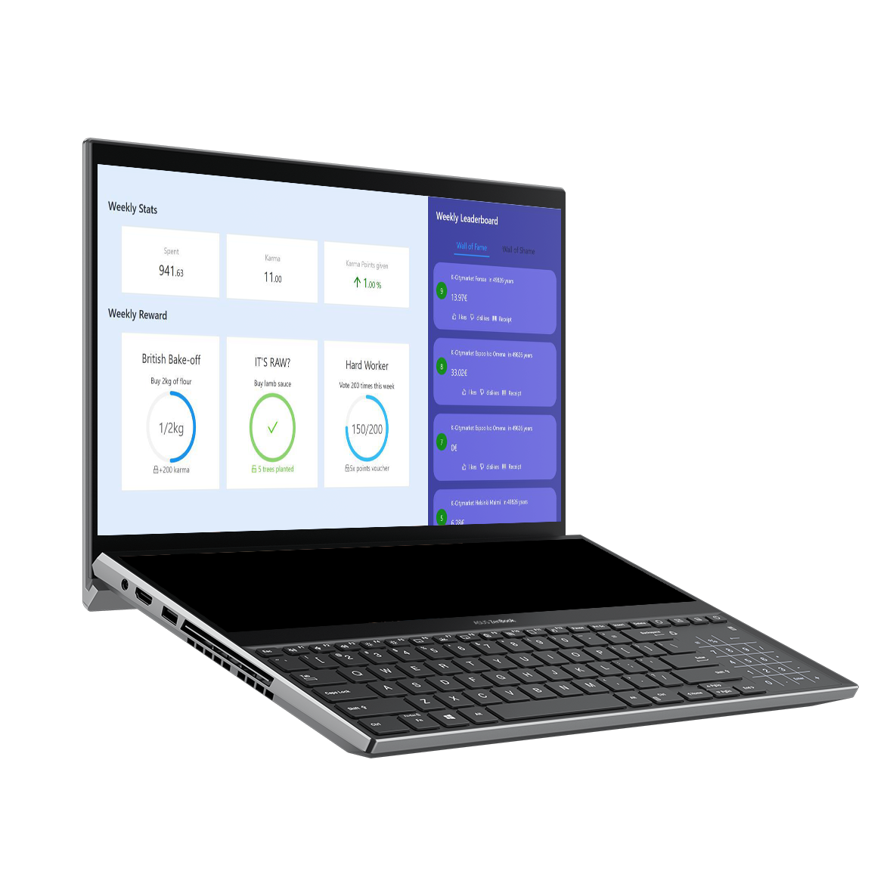

# Using __data__ to help people reduce __food waste__ and live healthier lives

&#xfeff  | &#xfeff  | &#xfeff
------------- | ------------- | -------------
Type  | Stack  | Code
Hackathon | Android  | [GitHub](https://github.com/robsel118/Junction_2019)
&#xfeff | React.js  | 
&#xfeff | Firebase  | 

<Grid columns="40% 60%">

## CHALLENGE

Junction is an annual hackathon that gathers around 1'500 hackers for a weekend long experience. A place where designers, developers, and other techies team up to create new tech projects in  under 48 hours.  
People are striving to make more sustainable choices in their everyday lives and consumption. Healthy choices, as well as being able to reduce the amount of food waste, are becoming more and more important values in modern society.  
As we know, climate change and increasing emissions raise concerns for many. However, lack of knowledge and tools restrict people from taking measures. It’s time for action and success requires cooperation.  
This year, CGI teamed-up with K-Group issued a challenge to find innovative ways of using transaction data from grocery retail and other retail segments to create new services to support people in making healthier and more sustainable choices in their everyday lives

</Grid>

<Grid columns="40% 60%">

## our Solution

Our team (composed of Matti and I) wanted to improve the clients' spending habits and sustainability through social interactions and gamification.   
For the social interaction side, we designed an application that allows a user to rate another anonymous user’s purchase basket. This will push the client to be more curious and mindful of the products they buy and they will become able to better distinguish the difference between certain products Moreover, a positive rating may encourage a user to continue buying sustainable product, whilst a negative rating may motivate another user to take on a healier life-style.  
On the game side, the application prrovides daily and weekly challenges that will help the users make healthier purchase decision or suggests them more sustainable alternative to products that they often buy. A completed challenge, provides points which can eventually be redeem, e.g. coupon or discount on certain products.  
As a result, we developed a React and Android application than can be used to rate baskets and view all the challenges and their progress. The data comes from a Firebase database which is filled with anonymous purchase basket data from the K-Group API.

</Grid>

<Grid columns="1fr 1fr">

</Grid>

<Grid columns="40% 60%">

## OVERVIEW

Hackathons are a great way to challenge our skills and learn new things, being surrounded by so many innovative people is an incredible experience. We gave our best effort into delivering a product we tought could really help people become more sustainable. During that time, I had the chance to improve my knowledge of React (also the new Hook system) and Firebase.  
The event went faster than expected, we saw just how important it is to properly plan things in advance to save some time down the road. Nevertheless, we managed to cook up a working prototyping to demonstrate to the jury. The idea and our demo was positively received by the challenge issuers, as a result, we were awarded second place.  
Overall, it was an amazing experience, an I want to give a special shoutout to my mate Matti for the fun adventure.

</Grid>

 
