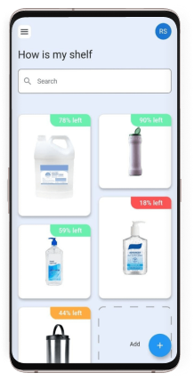

# Revolutionizing the way people __shop__ for __utilities__

&#xfeff  | &#xfeff  | &#xfeff
------------- | ------------- | -------------
Type  | Stack  | Code
Hackathon | Flutter  | [GitHub](https://github.com/robsel118/junction2020)
&#xfeff | Firebase  | 
&#xfeff | Node.js  | 

<Grid columns="40% 60%">

## CHALLENGE
 
Shopping for utilities is a repetitive chore for everyone – products have changed and evolved, but our way of buying them hasn’t. How could modern technology make this routine easier, more efficient, more effortless?  
Can an app warn you when you're running out of shampoo and maybe order it? Or can it even recommend you the most environmentally friendly alternative or the moisturizer containing the least parabens?  
At Junction 2020 Connected, Columbia Road challenged us to implement a solution to redesign the way we shop for utilities.
</Grid>

<Grid columns={'1fr 1fr 1fr'} style={{ alignItems: 'flex-end'}}>

 <figure>

  
 
  <figcaption>Concept Phase.</figcaption>
</figure> 
 <figure>

  

  <figcaption>Sketches Phase.</figcaption>
</figure> 
 <figure>

  
 
 <figcaption>Implementation Phase.</figcaption>
</figure> 

</Grid>

<Grid columns="40% 60%">

## our Solution

Our team (Matti and I) designed and developed a product that enables weight-based consumption tracking with real-time updates and projections, as well as automatic reminders. 
The software was implemented with Flutter mobile and Firebase. For the hardware, we used a load cell connected to a Raspberry Pi which sends the measurements to the Firebase real-time database. The data is then processed by cloud functions to calculate the projections.
</Grid>

 

<Grid columns="40% 60%">

## OVERVIEW

This was the third time participating in Junction, and we have learned from the narrow down our scope to be able to achieve what we wanted in time. Nevertheless, hackathons are still stressful, espacially since this edition required us to produce a video pitch. Despite that, our hard work paid off as we were selected as the winner of the challenge!

</Grid>

